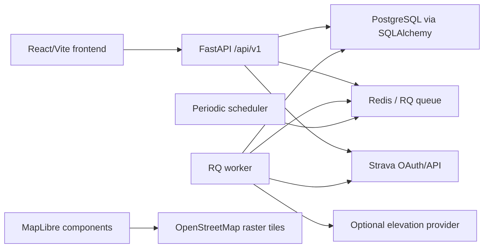

# Technical Documentation

This document maps the codebase as implemented. It complements `docs/high-level.md`, `docs/api.md`, `docs/metrics.md`, and `docs/privacy.md`.

## System Architecture



The backend is a FastAPI application created in `backend/app/main.py`. It configures logging, CORS, structured error handlers, database startup initialization, and the `/health` endpoint. All application routes are composed in `backend/app/api/router.py` under `/api/v1`.

The frontend is a React application created with Vite. `frontend/src/app/providers.tsx` wires TanStack Query, language context, and React Router. `frontend/src/app/router.tsx` protects authenticated routes through `/auth/me` and renders the app shell around the main pages.

## Runtime Services

- `db`: PostgreSQL 16, persistent `postgres_data` volume.
- `redis`: Redis 7 for RQ jobs.
- `api`: FastAPI with Alembic migrations before startup.
- `worker`: RQ worker for background jobs.
- `scheduler`: periodic Strava sync enqueue loop and optional daily portfolio demo refresh.
- `frontend`: Vite dev server in local compose, Nginx static frontend in prod compose.

## Configuration

Backend settings live in `backend/app/core/config.py` and read from `.env` or `../.env`.

Important values:

- `APP_ENV`, `APP_NAME`, `APP_BASE_URL`, `FRONTEND_BASE_URL`
- `SECRET_KEY`, `SESSION_COOKIE_NAME`, `SESSION_MAX_AGE_SECONDS`
- `TOKEN_ENCRYPTION_KEY`
- `OWNER_EMAIL`
- `DATABASE_URL`
- `REDIS_URL`
- `STRAVA_CLIENT_ID`, `STRAVA_CLIENT_SECRET`, `STRAVA_REDIRECT_URI`, `STRAVA_SCOPES`
- `STRAVA_AUTO_SYNC_ENABLED`, `STRAVA_AUTO_SYNC_INTERVAL_SECONDS`
- `DEMO_ACCOUNT_ENABLED`, `DEMO_ACCOUNT_EMAIL`, `DEMO_ACCOUNT_PASSWORD`, `DEMO_ACCOUNT_DISPLAY_NAME`
- `DEMO_REFRESH_ENABLED`, `DEMO_REFRESH_INTERVAL_SECONDS`, `DEMO_REFRESH_FROM_OWNER_PATTERNS`, `DEMO_REFRESH_HISTORY_WEEKS`
- `ROUTING_ENABLED`, `ROUTING_PROVIDER`, `VALHALLA_BASE_URL`, `ROUTE_SUGGESTION_MAX_DISTANCE_M`
- `VITE_API_BASE_URL`, `VITE_BASE_PATH`

Production cookies become secure when `APP_ENV=production` and `APP_BASE_URL` starts with `https://`.

## Authentication And Ownership

Authentication uses a signed session token stored in an HTTP-only cookie. Passwords use PBKDF2-SHA256 with per-password salt. Session tokens are HMAC-SHA256 signed JSON payloads with `sub`, `exp`, and `typ=session`.

`backend/app/api/deps.py` resolves the authenticated account from the session cookie and exposes `CurrentUser`. Routes that accept `CurrentUser` are authenticated. Queries are expected to filter by `user.id` or use a service helper that does.

First-run setup uses `OWNER_EMAIL` as the allowed email. If an owner already has a password, setup is rejected.

The optional portfolio demo account is represented by `users.is_demo=true`. `POST /auth/demo-login` creates or updates the configured demo account and starts a demo session when `DEMO_ACCOUNT_ENABLED=true` and a demo password is configured. Demo sessions can read demo-scoped data but cannot mutate data. `backend/app/api/deps.py` exposes `WritableUser`, which rejects demo users with `403 DEMO_READ_ONLY`; write endpoints use this dependency while read endpoints continue to use `CurrentUser`.

## Backend Module Catalog

- `app/core`: settings, crypto, security, structured exceptions, logging, timezone helpers.
- `app/db`: SQLAlchemy base, engine/session factory, startup table creation, owner creation, seed and seed cleanup scripts.
- `app/models`: SQLAlchemy data model.
- `app/schemas`: Pydantic request and response contracts.
- `app/api/routes`: FastAPI route groups.
- `app/services`: business logic for auth, activities, analytics, trends, events, export, gear, notifications, planning, profile, reports, and elevation correction.
- `app/analytics`: pure metric helpers for load, intensity, HR zone breakdown, and elevation gain.
- `app/providers`: Strava API/OAuth mapping/sync, optional elevation provider client, and optional Valhalla routing client.
- `app/jobs`: RQ queue, worker tasks, and periodic scheduler.
- `app/tests`: pytest coverage for auth, analytics, activities, events, planning, reports, Strava, notifications, migrations, preferences, elevation, calendar, app origins, seed cleanup, and HR zones.

## Data Model

### Owner And Preferences

- `users`: owner and optional demo account records with email, password hash, display name, timezone, units, `is_demo`, and timestamps.
- `user_preferences`: locale, dashboard mode, favorite/recent template IDs, pace zones, elevation correction settings, avatar icon, and uploaded avatar data URL.

### Provider Integration

- `provider_connections`: one provider connection per user/provider. Stores provider user ID, scopes, encrypted access token, encrypted refresh token, expiry, status, last sync timestamp, and last error.

### Activities

- `activities`: normalized imported or manual activity data. Stores provider identity, sport/workout type, names, UTC/local start, timezone, distance, time, elevation, speed, HR, cadence, calories, RPE, computed load, load source, intensity, elevation source, summary polyline, raw provider payload, timestamps.
- `activity_streams`: per-activity stream JSON keyed by stream type such as `time`, `distance`, `latlng`, `altitude`, `velocity_smooth`, `heartrate`, `cadence`, `moving`, `grade_smooth`, and `elevation_corrected`.
- `activity_notes`: owner notes and subjective values for activity RPE, fatigue, soreness, pain, sleep quality, and notes.

### Gear

- `gear`: shoes or other running gear with type, name, brand, model, start date, retirement distance, retired date, notes.
- `activity_gear`: many-to-many assignment table between activities and gear.

### Planning And Calendar

- `training_plans`: generated or manual plans with title, goal type, date range, status.
- `planned_workouts`: scheduled sessions with optional plan, date, session label, sort order, workout type, title, targets, intensity, instructions, completed activity link, and status.
- `workout_steps`: structured workout steps linked to planned workouts.
- `workout_templates`: reusable owner templates with unique owner/name constraint.
- `workout_pool_items`: unscheduled workout drafts that can be scheduled later.
- `calendar_events`: custom calendar markers.

### Events And Progress

- `events`: races or goal events with date, location, type, distance, elevation, surface, priority, status, target time, website, course map URL, GPX, poster image, and note fields.
- `weekly_metrics`: recomputed owner weekly aggregates for distance, time, elevation, run count, load, acute/chronic load, ramp ratio, intensity seconds, and long-run distance.
- `heart_rate_zone_sets`: dated HR zone definitions. The newest set whose `effective_from` is on or before an activity date applies.
- `notifications`: owner-facing in-app notifications with action links and deduplication source fields.

### Report Builder

- `report_templates`: owner-scoped structured Instagram report templates with JSON theme, sections, field defaults, default flag, and timestamps.
- `generated_reports`: owner-scoped saved report drafts with optional template link, report period, editable JSON values, and timestamps. Rendered PNG/SVG binaries are not stored.

## API Inventory

All routes below are under `/api/v1` unless noted. All routes require authentication except setup/login/demo-login/logout and `/health`.

### Auth

- `POST /auth/setup-owner`: set first owner password and create session.
- `GET /auth/options`: return public auth options such as demo login availability.
- `POST /auth/login`: authenticate and set session.
- `POST /auth/demo-login`: start the configured public read-only demo session when enabled.
- `POST /auth/logout`: clear session.
- `GET /auth/me`: return current owner.
- `POST /auth/change-password`: change password after verifying current password.

### Strava

- `GET /connections/strava/start`: start browser OAuth and set OAuth state cookie.
- `GET /connections/strava/callback`: validate state, exchange code, store encrypted tokens, redirect to frontend result.
- `GET /connections/strava/status`: return connection status, missing scopes, last sync, last error, and active job.
- `POST /connections/strava/sync`: enqueue recent or history sync unless an owner sync is already active.
- `GET /connections/strava/sync/{job_id}`: return owner-scoped RQ job status and sanitized progress.
- `POST /connections/strava/disconnect`: mark disconnected and clear local tokens.

### Activities

- `GET /activities`: list owner activities with filters for date, sport, workout, intensity, distance, HR presence, gear, paging, and sort.
- `GET /activities/{activity_id}`: return one activity with HR zone breakdown.
- `PATCH /activities/{activity_id}`: update editable activity fields and recompute metrics.
- `GET /activities/{activity_id}/streams`: return stored streams.
- `GET /activities/{activity_id}/splits`: return stream-based or summary split data.
- `PUT /activities/{activity_id}/notes`: create or update notes and recompute weekly metrics.
- `POST /activities/{activity_id}/gear/{gear_id}`: attach gear.
- `DELETE /activities/{activity_id}/gear/{gear_id}`: detach gear.

### Analytics

- `GET /analytics/dashboard`: dashboard payload for a period and optional selected week.
- `GET /analytics/weekly`: weekly metrics in an optional date range.
- `GET /analytics/yearly-summary`: running distance, elevation gain, and moving time for one full owner-local calendar year.
- `GET /analytics/recent-weeks`: dense recent weekly metrics.
- `GET /analytics/trend-metrics`: on-demand detailed trend metrics.
- `GET /analytics/load`: weekly load view.
- `GET /analytics/intensity`: weekly intensity split.
- `GET /analytics/aerobic-trend`: easy-run efficiency points.
- `GET /analytics/prs`: activity-level personal record summaries.
- `GET /analytics/heatmap`: aggregated route density cells and bounds.

### Report Builder

- `GET /report-templates`: list owner templates.
- `POST /report-templates`: create template.
- `GET /report-templates/{template_id}`: read one owner template.
- `PATCH /report-templates/{template_id}`: update one owner template.
- `DELETE /report-templates/{template_id}`: delete one owner template.
- `GET /reports`: list saved report drafts.
- `POST /reports`: create saved report draft.
- `GET /reports/{report_id}`: read one owner saved report draft.
- `PATCH /reports/{report_id}`: update one owner saved report draft.
- `DELETE /reports/{report_id}`: delete one owner saved report draft.
- `POST /reports/prefill`: prefill editable report values from owner-scoped weekly plan and activity data.
- `POST /reports/render.svg`: render submitted report values as SVG.
- `POST /reports/render.png`: render submitted report values as PNG.

### Routes

- `POST /routes/suggest-loop`: owner-authenticated loop route suggestions from a start coordinate and route preferences. Routing is disabled by default and returns `status="unavailable"` until local Valhalla is configured.

### Events

- `GET /events`: list events with preparation metrics.
- `POST /events`: create an event.
- `GET /events/{event_id}`: read one event.
- `GET /events/{event_id}/planning-guidance`: transparent event planning guidance.
- `GET /events/{event_id}/readiness`: transparent event readiness cockpit metrics and guidance.
- `PATCH /events/{event_id}`: update event details.
- `DELETE /events/{event_id}`: delete event.

### Planning And Calendar

- `GET /calendar`: planned workouts, completed activities, custom events, and goal events in a date range.
- `POST /calendar/week`: replace one week of non-completed planned workouts.
- `POST /calendar/week/copy`: copy one owner's week into another week.
- `POST /calendar/events`: create custom calendar event.
- `PATCH /calendar/events/{event_id}`: update custom calendar event.
- `DELETE /calendar/events/{event_id}`: delete custom calendar event.
- `GET /workout-templates`: list templates, creating defaults if missing.
- `POST /workout-templates`: create template.
- `PATCH /workout-templates/{template_id}`: update template.
- `DELETE /workout-templates/{template_id}`: delete template.
- `GET /workout-pool`: list unscheduled workout drafts.
- `POST /workout-pool`: create pool item.
- `GET /workout-pool/{pool_item_id}`: get pool item.
- `PATCH /workout-pool/{pool_item_id}`: update pool item.
- `DELETE /workout-pool/{pool_item_id}`: delete pool item.
- `POST /workout-pool/{pool_item_id}/schedule`: schedule and remove a pool item.
- `POST /planned-workouts`: create planned workout.
- `GET /planned-workouts/{workout_id}`: get planned workout.
- `PATCH /planned-workouts/{workout_id}`: update planned workout.
- `DELETE /planned-workouts/{workout_id}`: delete planned workout.
- `POST /plans/generate`: generate and persist a draft plan.
- `GET /plans`: list plans.
- `GET /plans/{plan_id}`: get plan with workouts.
- `PATCH /plans/{plan_id}`: update plan fields.
- `POST /plans/{plan_id}/activate`: activate plan.
- `POST /plans/{plan_id}/archive`: archive plan.

### Profile And Settings

- `GET /profile/hr-zones`: list HR zone history.
- `POST /profile/hr-zones`: create or replace one dated zone set and recompute HR stream metrics.
- `POST /profile/hr-zones/recompute`: recompute HR-based load/intensity.
- `GET /profile/preferences`: get or create preferences.
- `PATCH /profile/preferences`: update preferences.
- `POST /profile/elevation/recompute`: recompute GPS-based elevation for matching activities.

### Gear

- `GET /gear`: list gear with computed distance and retirement warning.
- `POST /gear`: create gear.
- `GET /gear/{gear_id}`: get gear.
- `PATCH /gear/{gear_id}`: update gear.
- `DELETE /gear/{gear_id}`: delete gear.
- `GET /gear/{gear_id}/activities`: list assigned activities.

### Notifications

- `GET /notifications`: list notifications, optionally unread-only.
- `GET /notifications/summary`: unread count.
- `POST /notifications/{notification_id}/read`: mark one read.
- `POST /notifications/read-all`: mark all read.
- `DELETE /notifications/{notification_id}`: delete one notification.

### Privacy

- `GET /export/data`: ZIP export of local owner data without tokens.
- `DELETE /account`: delete owner and cascaded local data.

## Metric Rules

Training load uses the first available source:

1. HR stream or average HR plus effective HR zones: minutes in zones weighted by `[1, 2, 3, 5, 8]`.
2. RPE: duration minutes multiplied by RPE.
3. Duration fallback: duration minutes multiplied by `2.0`.

Intensity classification uses workout type first for hard workouts, then HR distribution, then RPE, then unknown:

- Hard workout type: `race`, `intervals`, `tempo`, `hills`, `fartlek`.
- HR-based hard: at least 20% in Z4/Z5.
- HR-based easy: at least 70% in Z1/Z2.
- RPE 1-4 easy, 5-6 moderate, 7-10 hard.

Weekly metrics are fully recomputed for the owner when requested by analytics or after metric-affecting changes. Dense endpoints fill missing weeks with zero values.

Detailed trend metrics are calculated on demand from activities, streams, HR zones, and planned workouts. They include HR zone time, easy pace, long-run share, run-day count, hilliness, pace by HR zone, plan adherence, monotony, and coach-effect codes.

Event preparation is calculated from owner-local dates, recent activity windows, future planned workouts, target distance/time, missed sessions, and event status. Event readiness is a live response built on the same owner-scoped data, adding recent run count, intensity mix, readiness items, and non-medical guidance messages for the event detail cockpit.

## Strava Sync

Strava OAuth starts in the backend, stores a state cookie, redirects to Strava, validates state on callback, and stores encrypted tokens in `provider_connections`.

Sync behavior:

- Recent sync backfills the last 730 days if no Strava history exists or existing history is incomplete.
- Otherwise recent sync starts from newest imported Strava activity minus seven days.
- History sync accepts optional `after_date` and `before_date`.
- Only running activity types are imported.
- Details and streams are fetched per activity.
- Activity upsert is idempotent by provider and provider activity ID.
- Streams are upserted by activity and stream type.
- New activities can create note reminder notifications.
- Metrics and weekly aggregates are recomputed after sync.
- Rate limits are recorded and can stop sync without crashing the worker.

## Background Jobs

RQ queue name is `running-tracker`.

- `strava_sync_recent_task(owner_id)`: runs recent Strava sync.
- `strava_sync_history_task(owner_id, after_date, before_date)`: runs historical sync.
- `recompute_owner_aggregates(owner_id)`: recomputes weekly metrics.

The scheduler enqueues recent Strava syncs for connected owners without active sync jobs. The interval is clamped between 60 seconds and 6 hours, so automatic sync runs at least four times per day when enabled.

When `DEMO_REFRESH_ENABLED=true`, the same scheduler process also runs `refresh_demo_account()` after `DEMO_REFRESH_INTERVAL_SECONDS` has elapsed. Portfolio deployments should run exactly one scheduler process so the demo refresh remains daily and Strava sync scheduling is not duplicated.

The manual demo refresh entrypoint is:

```bash
cd backend
python -m app.db.refresh_demo_account --from-owner-patterns --weeks 78
```

`--synthetic-only` ignores owner aggregate patterns. The refresh service creates the demo user if needed, removes generated demo records for that user only, generates fictional capital-city routes, activities, streams, HR zones, gear, plans, events, and weekly metrics, and never creates provider connections or provider tokens for the demo account.

Job progress is sanitized to whitelisted fields before exposure: phase, imported, skipped, streams, current activity, started timestamp, and updated timestamp.

## Elevation Correction

Elevation correction is optional and controlled by user preferences. It requires `elevation_correction_enabled=true` and a provider URL.

Modes:

- `only_when_zero`: correct activities with missing or zero elevation gain.
- `always`: correct all GPS activities.

The service reads `latlng` streams, samples up to 100 points, calls the configured provider, calculates positive gain while ignoring small noise, stores `elevation_corrected` stream data, updates activity elevation, and marks source as `dem_corrected`.

Open-Meteo elevation URLs are supported with query parameters; other providers are called with a JSON `locations` payload.

## Frontend Module Catalog

### App And Routing

- `frontend/src/main.tsx`: React root entrypoint.
- `frontend/src/app/App.tsx`: app wrapper.
- `frontend/src/app/providers.tsx`: QueryClient, language provider, BrowserRouter basename.
- `frontend/src/app/router.tsx`: login/setup routes and protected app routes.
- `frontend/src/app/queryClient.ts`: default query retry, focus, and stale-time settings.

Routes:

- `/login`
- `/setup`
- `/dashboard`
- `/activities`
- `/activities/:activityId`
- `/calendar`
- `/events`
- `/events/:eventId`
- `/heatmap`
- `/routes`
- `/plans`
- `/trends`
- `/settings/*`

### API Client And Query Hooks

`frontend/src/lib/api/client.ts` centralizes fetch behavior. It always sends credentials, JSON-encodes object bodies, maps non-2xx JSON errors into `ApiError`, handles `204`, and redirects on `401`.

Feature API modules define TanStack Query hooks:

- `features/auth/api.ts`: owner setup, login, demo login, logout, current account.
- `features/connections/api.ts`: Strava status, sync, sync job polling, disconnect, connect URL, cache invalidation.
- `features/dashboard/api.ts`: dashboard payload.
- `features/activities/api.ts`: list/detail/streams/splits/notes.
- `features/analytics/api.ts`: weekly analytics, recent weeks, trend metrics, aerobic trend, PRs, heatmap.
- `features/routes/api.ts`: self-hosted loop route suggestion mutation.
- `features/events/api.ts`: events, event detail, create/update, planning guidance, readiness.
- `features/plans/api.ts`: calendar, templates, week schedule, week copy, workout pool, events, plans, generate plan.
- `features/reports/api.ts`: report templates, weekly prefill, saved report drafts, and SVG/PNG render requests.
- `features/profile/api.ts`: HR zones, preferences, HR recompute, elevation recompute.
- `features/notifications/api.ts`: summary, list, read, read all, delete with optimistic update.

### Pages

- `DashboardPage`: metrics, Strava sync controls/progress, onboarding checklist, week plan comparison, charts, recent activities, upcoming workouts.
- `ActivitiesPage`: activity table and intensity filter.
- `ActivityDetailPage`: metrics, map, stream charts, splits, HR zone breakdown, trail effort, notes.
- `CalendarPage`: week/month calendar, custom event modal, day drawer.
- `PlansPage`: manual weekly scheduler, multi-session day support, templates, workout pool, copy week, live planned metrics.
- `EventsPage`: event list, event creation wizard, event preparation cards.
- `EventDetailPage`: event metrics, readiness cockpit, editable details, GPX/course map, poster image, guidance, notes.
- `TrendsPage`: trend charts, recent balance, durability, personal records, coach-effect signals.
- `HeatmapPage`: route density map and range filters.
- `ReportsPage`: annual stats, legacy weekly report download, Instagram report template selection, structured editing, prefill, preview, export, and save actions.
- `SettingsPage`: display preferences, language, Strava controls, HR zones, recalculation, elevation, export/delete, avatar.
- `LoginPage` and `SetupPage`: auth forms, including a demo login action when the backend enables it.

### Shared Components

- `AppShell`: sidebar, mobile bottom nav, today card, notifications popover, avatar editor, logout.
- UI primitives: `Drawer`, `EmptyState`, `MetricCard`, `PageHeader`, `ProgressMeter`, `StatusPill`.
- Charts: `WeeklyCharts.tsx`, `TrendMetricCharts.tsx` based on Recharts.
- Maps: `ActivityMap.tsx` and `RunHeatmap.tsx` based on dynamic MapLibre imports and OpenStreetMap raster tiles.
- Visuals: `RunnerScene.tsx`, a code-native SVG scene used for heroes and empty states.

### Frontend Utilities

- `lib/date.ts`: ISO date math, week starts, month ranges, weekday labels.
- `lib/format.ts`: locale-aware date formatting, distance, duration, split duration, pace, percentages.
- `lib/i18n.tsx`: Czech and English translations, locale context, enum labels.
- `lib/polyline.ts`: route polyline decoding.
- `lib/routes.ts`: frontend base path normalization.

## Database Migrations

Alembic is configured in `backend/alembic.ini` and `backend/alembic/env.py`.

Migration history:

- `202604280001_initial_schema.py`: users, provider connections, activities, streams, notes, gear, activity gear, plans, planned workouts, workout steps, templates, weekly metrics.
- `202604290001_hr_zones_calendar_events.py`: HR zone sets and custom calendar events.
- `202604290002_events.py`: goal event table.
- `202604300001_preferences_workout_pool.py`: user preferences and workout pool.
- `202605110001_elevation_correction.py`: elevation correction preferences and activity elevation source.
- `202605160001_event_course_data.py`: event course map URL and GPX.
- `202605170001_event_poster_image.py`: event poster image data.
- `202605170002_notifications.py`: notifications.
- `202605210001_avatar_preferences.py`: avatar icon and uploaded avatar image.
- `202605220001_planned_workout_sessions.py`: planned workout session labels and sort order.
- `202606040001_demo_account.py`: demo account flag on users.
- `202606060001_report_builder.py`: report templates and saved report drafts.

The app also calls `Base.metadata.create_all()` on startup for local personal-deployment convenience, but migrations remain the explicit schema history.

## Tests

Backend tests are under `backend/app/tests` and use pytest. Coverage includes:

- auth setup/login/logout/password changes
- demo login, demo read-only guards, and demo data refresh
- CORS origins
- crypto
- activity listing/details/notes/splits
- analytics, HR zones, weekly metrics, trends, heatmap
- calendar and week scheduling
- events and event detail/guidance
- planning service
- profile preferences
- notifications
- Strava mapper, OAuth, sync, scheduler
- elevation correction
- migrations
- seed cleanup

Frontend tests use Vitest and Testing Library. Coverage includes:

- API client behavior
- route helpers and formatting helpers
- shell behavior
- dashboard, activity detail, calendar, events, heatmap, login, plans, settings, trends
- chart helper behavior

## Local Commands

Backend:

```bash
cd backend
python -m venv .venv
.venv/bin/python -m pip install -e '.[test]'
.venv/bin/python -m pytest
alembic upgrade head
python -m app.db.seed_dev
python -m app.db.cleanup_seed
python -m app.db.refresh_demo_account --from-owner-patterns --weeks 78
python -m app.jobs.worker
python -m app.jobs.scheduler
```

Frontend:

```bash
cd frontend
npm install
npm test
npm run build
npm run dev
```

Full stack:

```bash
docker compose up --build
docker compose -f docker-compose.prod.yml up --build
```

## Source-Control And Generated Files

Generated or local-only folders should not be used as documentation source:

- `backend/.venv`
- `frontend/node_modules`
- `backend/app/**/__pycache__`
- `backend/.pytest_cache`
- `frontend/dist`
- `frontend/test-results`
- `backend/running_tracker_backend.egg-info`

## Known Technical Boundaries

- Gear backend API exists, but there is no dedicated top-level frontend gear page.
- The frontend uses OpenStreetMap raster tiles directly in MapLibre style definitions.
- PR detection is activity-level, not stream-level.
- Automatic sync depends on Redis/RQ and the scheduler process.
- Elevation correction depends on an external HTTP provider configured by the owner.
- The app is single-owner by design; adding real multi-user support would require route, query, token, UI, and data-retention review.
